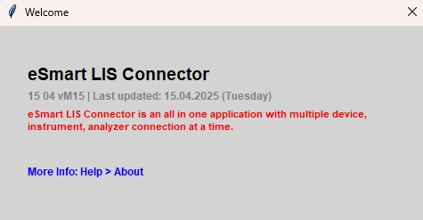
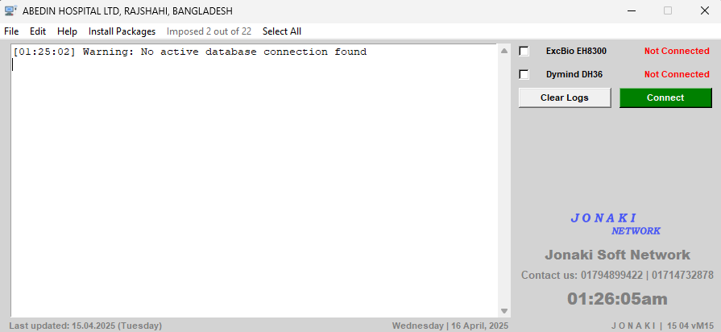
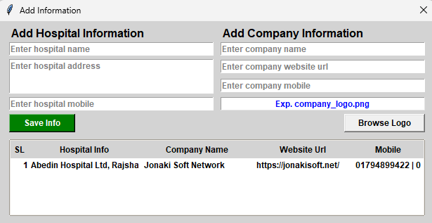
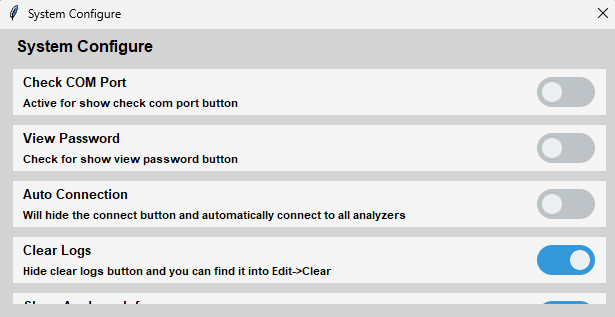
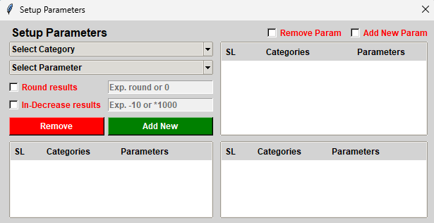
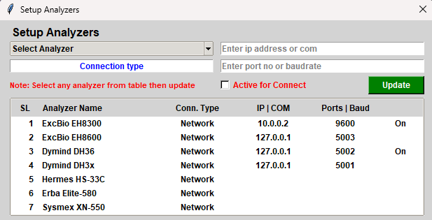
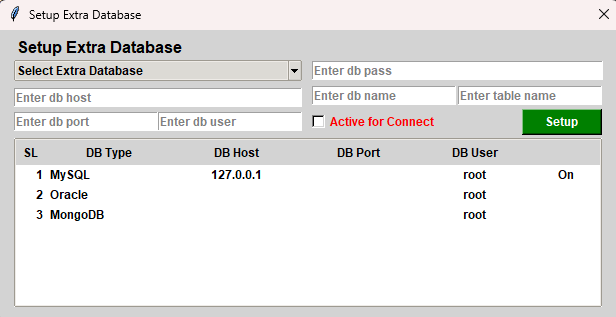
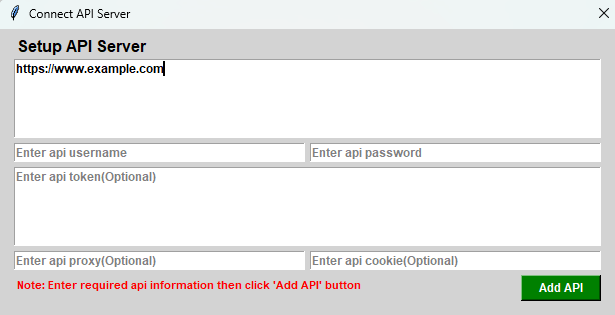
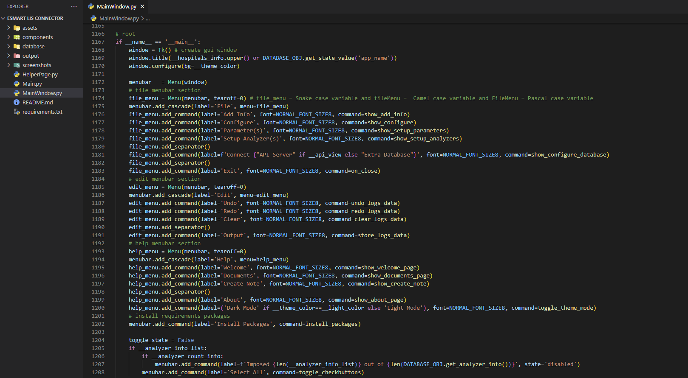
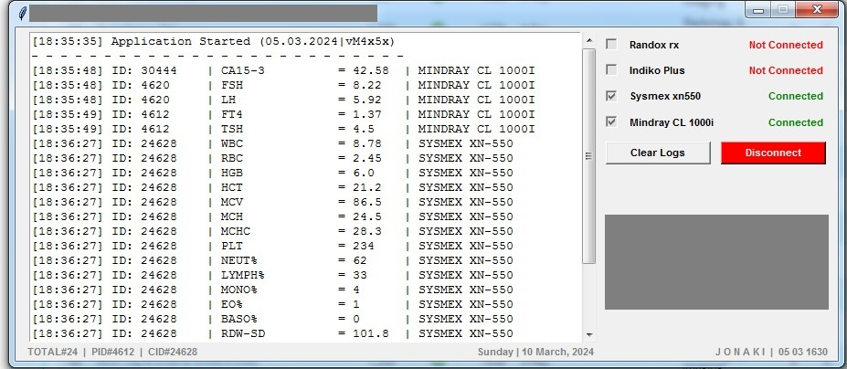

# eSmart LIS Connector

### **A Python3 gui-based _lis connector_ using Tkinter GUI**

[Tkinter](https://en.wikipedia.org/wiki/Tkinter) is a Python binding to the Tk GUI toolkit. It is the standard Python interface to the Tk GUI toolkit, and is Python's defacto standard GUI.
<br/>

**eSmart LIS Connector** is a communication bridge between medical pathology analyzers and LIS servers. It supports both serial and network connections in unidirectional or bidirectional modes using ASTM or HL7 protocols. The connector receives raw byte data, parses it, and sends it to a local or API-based server/database. It is capable of handling multiple analyzers simultaneously, ensuring seamless and real-time data communication.
<br/>

**`eSmart LIS Connector` supports serial and network communication protocols, simulates and exchanges data using ASTM and HL7 formats and is compatible with `all types of pathology analyzers`.**


## Task Description
This project is fully customizable and dynamic. It is designed to build a Python and Tkinter-based desktop application that connects directly to any type of analyzer via network or serial port communication, receives data, parses the results and sends them to an api server or database. You can add pathologist information, doctor information with signature. Everyday create report folder with file name is current date and printed result stored as pdf. Already `35+ Company or Category Analyzers` use this. Here are some special features added.


* **Change theme**
* **Running time clock**
* **Generate txt file of logs data**
* **Live data receive from multiple analyzers**
* **Send data to multiple database or API server**


## Task Requirements & Testing Environment
This project was developed using the latest operating systems, software, and tools.

* **Operating System :** Windows11, Kali Linux
* **Software :** Python3.12 and Visual Studio Code
* **System Type :** 32-bit and 64-bit
* **Analyzer Company :** Sysmex, ExcBio, Hermes, Genrui, Dymind, Rayto, ZECEN, Arrows, GeteIn, Arkray, Drawray, Erba, Mindray, ZyBio, Randox, Snibe, Cobas, Beckman Coulter, Indiko etc as tested.
* **Connection :** Multiple analyzers connect at a time.
* **Mode :** Single/Bidirectional/Unidirectional.
* **Protocol :** ASTM/HL7 (TCP/IP, COM).
* **Options :** 3/5/6 parts or others.
* **Types :** Hematology, Auto-Biochemistry, Auto-Horme/Immunology or any type of analyzers.
* **Database :** Multiple(SQLite3, MySQL, Oracle, MongoDB etc) database connection at a time.


## Installation
First [download](https://www.python.org/downloads/), install and configure [python](https://www.python.org/doc/). Then use the package manager [pip](https://pip.pypa.io/en/stable/) to install on.

* Windows installation
* Kali linux installation
---


## The project is structured as follows:

```bash
esmart-lis-connector/
│
├── assets/
├── components/
├── database/
├── logs/
├── output/
├── screenshots/
│   ├── welcome.png
│   ├── ...
│
├── doc_note.txt
├── MainWindow.py        # main file
├── notes.txt            # how to use
├── README.md            # project description
├── requirements.txt     # lists of all python libraries
└── LICENSE              # license file
```


## Clone the Repository

```bash
git clone https://github.com/iamx-ariful-islam/esmart-lis-connector.git
```


## Notes
The `requirements.txt` file, lists of all the Python libraries that my "**_esmart lis connector system_**" depends on and installs those packages from the file and for better use, configure the system by looking at the `notes.txt` name file:

```bash
pip install -r requirements.txt
# or
sudo pip install -r requirements.txt
```


## Screenshots
Here are some screenshots of the `eSmart LIS Connector` project:

**Welcome Page**<br/>
<br/>
**Main Window**<br/>
<br/>
**Add Information**<br/>
<br/>
**System Configure**<br/>
<br/>
**Parameters Setup**<br/>
<br/>
**Analyzers Setup**<br/>
<br/>
**Setup Extra Database**<br/>
<br/>
**API Server Setup**<br/>
<br/>
**Code Snapshot**<br/>
<br/>
**Output-Data is sent to a MySQL server | Old Version | Windows 7**<br/>
<br/>


## Contributing

Contributions, suggestions, and feedback are always welcome! ❤️
To contribute:

1. Fork the repository
1. Create a new branch (`feature/new-feature`)
1. Commit your changes
1. Push and submit a Pull Request

💬 You can also open an issue if you’d like to discuss a feature or report a bug.


## For more or connect with me

<p align='center'>
  <a href="https://github.com/iamx-ariful-islam"></a>&nbsp;&nbsp;
  <a href="https://bd.linkedin.com/in/iamx-ariful-islam"></a>&nbsp;&nbsp;
  <a href="https://x.com/mx_ariful_islam"></a>&nbsp;&nbsp;
  <a href="https://www.facebook.com/iamx.ariful.islam/"></a>
</p>


## License

The [MIT](https://choosealicense.com/licenses/mit/) License (MIT)


## 💖 Thank You for Visiting!

> “Good design is about making things simple yet significant”  
> — *Md. Ariful Islam*
